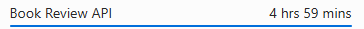

# Book Review API

A RESTful API for managing books, user reviews, and authentication, built with Node.js, Express, and MongoDB. It supports book searches, image/PDF uploads to AWS S3, and caching with Redis.

## Tech Stack and Libraries

### Core Technologies
- **Node.js**: JavaScript runtime for server-side logic.
- **Express.js**: Web framework for RESTful APIs.
- **MongoDB**: NoSQL database for storing books, users, and reviews (via `mongoose`).
- **Redis**: In-memory data store for caching (via `ioredis`, configured for cloud Redis).
- **AWS S3**: File storage for book images and PDFs.

## Project Time  
  
The total time spent on the project is 4 hours and 59 minutes.

## Documentation & Resources

- **Database Schema Design:** [Database Schema](database.md)
- **Postman Collection:** [Postman Collection](backend.postman_collection.json)

### In the Add Book section, the PDF upload is meant for uploading the first two pages of the book, which include the author and other publication details.

### npm Dependencies
- `@aws-sdk/client-s3`, `@aws-sdk/s3-request-presigner`: AWS S3 file uploads and pre-signed URLs.
- `bcryptjs`: Password hashing for authentication.
- `compression`: Gzip compression for responses.
- `cookie-parser`: Parse cookies for authentication.
- `cors`: Enable cross-origin resource sharing.
- `dotenv`: Load environment variables.
- `express`: Core framework for routing and middleware.
- `express-mongo-sanitize`: Prevent MongoDB injection.
- `express-rate-limit`: Rate limiting for requests.
- `express-xss-sanitizer`: Prevent XSS attacks.
- `helmet`: Secure HTTP headers.
- `ioredis`: Redis client for cloud Redis.
- `jsonwebtoken`: JWT-based authentication.
- `mongoose`: MongoDB ORM.
- `mongoose-aggregate-paginate-v2`: Pagination for MongoDB queries.
- `morgan`: HTTP request logging (development).
- `multer`: Handle multipart form data for file uploads.
- `pdf-lib`: Compress PDF files.
- `sharp`: Compress images (JPG, JPEG, PNG, WEBP).
- `tslib`: TypeScript utilities.

### Development Dependencies
- `nodemon`: Auto-restart server during development.
- `prettier`: Code formatting.

## Setup Instructions

### Prerequisites
- **Node.js**: Version ≥ 16 (recommended ≥ 18 for `sharp`).
- **MongoDB**: Local or cloud instance (e.g., MongoDB Atlas).
- **Redis**: Cloud instance (e.g., Redis Labs, AWS ElastiCache).
- **AWS S3**: Bucket with credentials for uploads.

### Environment Variables
Create a `.env` file in the project root:

```plaintext
# Set to true in production environment
IS_PROD= # Example: true or false

# MongoDB connection string - add your MongoDB URI here
MONGODB_URI=mongodb://mongo:27017 # Example: docker default config

# Port number for the server - default is usually 3000
PORT= # Example: 3000

# AWS Region for S3 and other AWS services
AWS_REGION= # Example: us-east-1

# AWS Access Key ID - get from AWS IAM console
AWS_ACCESS_KEY_ID= # Example: ABCDEFGHIJKLMNOPQRST

# AWS Secret Access Key - get from AWS IAM console
AWS_SECRET_ACCESS_KEY= # Example: abcdefghijklmnopqrstuvwxyz1234567890

# Name of your S3 bucket for storing files
AWS_S3_BUCKET_NAME= # Example: my-s3-bucket-name

# Secret key for signing access tokens
ACCESS_TOKEN_SECRET= # Example: your_super_secret_key

# Secret key for signing refresh tokens
REFRESH_TOKEN_SECRET= # Example: your_refresh_secret_key

# Expiry duration for access tokens
ACCESS_TOKEN_EXPIRY= # Example: 1h

# Expiry duration for refresh tokens
REFRESH_TOKEN_EXPIRY= # Example: 7d

# Redis host - default for Docker setup
REDIS_HOST=redis # Example: redis (Docker default)

# Redis port - default for Docker setup
REDIS_PORT=6379 # Example: 6379 (Docker default)

# Redis password - set your Redis password here
REDIS_PASSWORD=RedisPassword123 # Example: password (Docker default)

```

### Docker Setup

1. **Create a `Dockerfile`**:
   ```dockerfile
   FROM node:22-alpine
   WORKDIR /app
   COPY package*.json ./
   RUN npm install
   COPY . .
   EXPOSE 3000
   CMD ["npm", "start"]
   ```

2. **Create a `docker-compose.yml`**:
 ```yaml
version: "3.9"

services:
  redis:
    image: redis:7-alpine
    container_name: book-review-redis
    ports:
      - "6379:6379"
    command: redis-server --requirepass "${REDIS_PASSWORD}"
    environment:
      - REDIS_PASSWORD=${REDIS_PASSWORD}

  mongo:
    image: mongo:6.0
    container_name: book-review-mongo
    ports:
      - "27017:27017"
    volumes:
      - mongo-data:/data/db
    depends_on:
      - redis

  backend:
    container_name: book-review-backend
    build:
      context: .
      dockerfile: Dockerfile
    ports:
      - "3000:3000"
    env_file:
      - .env
    environment:
      - REDIS_HOST=redis
      - REDIS_PORT=6379
      - REDIS_PASSWORD=${REDIS_PASSWORD}
      - MONGO_HOST=mongo
      - MONGO_PORT=27017
    volumes:
      - ./:/usr/src/app
      - /usr/src/app/node_modules
    depends_on:
      - mongo
      - redis

volumes:
  mongo-data:
```

3. **Update `.env`**:
   ```plaintext
   MONGODB_URI=mongodb://mongo:27017
   For Docker mongodb://mongo:27017
   # Other variables as above
   ```

4. **Build and Run**:
   ```bash
   docker-compose up -d
   ```

5. **Test the API**:
   - Access at `http://localhost:3000/api/v1`.

6. **Set Up AWS S3**:
   - Create a  s3 bucket `bucket-name-here`.
   - Update `AWS_REGION`, `AWS_ACCESS_KEY_ID`, `AWS_SECRET_ACCESS_KEY`, and `AWS_S3_BUCKET_NAME` in `.env`.
   - Apply the following S3 bucket policy to allow public read/write access to the `public/` prefix:

     ```json
     {
         "Version": "2012-10-17",
         "Statement": [
             {
                 "Sid": "PublicReadAccess",
                 "Effect": "Allow",
                 "Principal": "*",
                 "Action": "s3:GetObject",
                 "Resource": "arn:aws:s3:::bucket-name-here/public/*"
             },
             {
                 "Sid": "PublicPutAccess",
                 "Effect": "Allow",
                 "Principal": "*",
                 "Action": [
                     "s3:PutObject",
                     "s3:PutObjectAcl"
                 ],
                 "Resource": "arn:aws:s3:::bucket-name-here/public/*"
             }
         ]
     }
     ```

     **⚠️ Warning**: This policy allows *public* read and write access, which is insecure for production. Consider restricting `Principal` to specific IAM roles or using pre-signed URLs.

   - Ensure your AWS credentials have `s3:PutObject` and `s3:GetObject` permissions.

### Non-Docker Setup

1. **Clone the Repository**:
   ```bash
   git clone https://github.com/syedtasavour/Book-Review-API.git
   cd Book-Review-API
   ```

2. **Install Dependencies**:
   ```bash
   npm install
   ```

3. **Set Up MongoDB**:
   - Local: Install MongoDB and start (`mongod`).
   - Cloud: Use MongoDB Atlas and update `MONGODB_URI`.

4. **Set Up Cloud Redis**:
   - Sign up for a cloud Redis provider (e.g., Redis Labs).
   - Update `REDIS_HOST`, `REDIS_PORT`, `REDIS_PASSWORD`, `REDIS_TLS` in `.env`.
   - Example `ioredis` configuration:
     ```javascript
     import Redis from 'ioredis';
     const redis = new Redis({
         host: process.env.REDIS_HOST,
         port: process.env.REDIS_PORT,
         password: process.env.REDIS_PASSWORD,
         tls: process.env.REDIS_TLS === 'true' ? {} : undefined,
     });
     ```

5. **Set Up AWS S3**:
   - Create an S3 bucket and update `AWS_*` variables in `.env`.
   - Ensure IAM permissions allow `s3:PutObject` and `s3:GetObject`.

6. **Run the Application**:
   - Development:
     ```bash
     npm run dev
     ```
   - Production:
     ```bash
     npm start
     ```

7. **Test the API**:
   - Use the Postman collection (`Book Review.postman_collection.json`).
   - Set `server` to `http://localhost:8000/api/v1`.
## API Endpoints

### User Routes
- **POST /api/v1/users/signup**
  - **Request**: Form-data: `email` (string), `name` (string), `password` (string), `profile` (file).
  - **Expected Response** (200):
    ```json
    {
        "statusCode": 200,
        "data": {
            "_id": "68413847cd5209498664c8ec",
            "email": "Hi@syedtasavour.me",
            "name": "Syed Tasavour",
            "profile": "https://s3.amazonaws.com/profiles/user.png",
            "token": "jwt-token"
        },
        "message": "User registered successfully"
    }
    ```
  - **Errors**:
    - 400: "Email, name, or password missing"
    - 400: "Invalid email format"
    - 409: "User already exists"
    - 500: "Failed to upload profile image"

- **POST /api/v1/users/login**
  - **Request**: JSON: `{ "email": "string", "password": "string" }`
  - **Expected Response** (200):
    ```json
    {
        "statusCode": 200,
        "data": {
            "_id": "68413847cd5209498664c8ec",
            "email": "Hi@syedtasavour.me",
            "name": "Syed Tasavour",
            "token": "jwt-token"
        },
        "message": "Login successful"
    }
    ```
  - **Errors**:
    - 400: "Email or password missing"
    - 401: "Invalid credentials"
    - 500: "Server error"

- **POST /api/v1/users/logout**
  - **Request**: JSON: `{ "email": "string", "password": "string" }` (Note: Typically, logout only requires a JWT token in headers).
  - **Expected Response** (200):
    ```json
    {
        "statusCode": 200,
        "data": null,
        "message": "Logout successful"
    }
    ```
  - **Errors**:
    - 401: "Unauthorized: Invalid token"
    - 500: "Server error"

- **PATCH /api/v1/users/refresh-token**
  - **Request**: JSON: `{ "email": "string", "password": "string" }` (Note: Typically uses a refresh token).
  - **Expected Response** (200):
    ```json
    {
        "statusCode": 200,
        "data": { "token": "new-jwt-token" },
        "message": "Token refreshed successfully"
    }
    ```
  - **Errors**:
    - 400: "Invalid refresh token"
    - 401: "Unauthorized"
    - 500: "Server error"

### Book Routes
- **POST /api/v1/books/**
  - **Request**: Form-data: `title` (string), `author` (string), `genre` (string), `coverImage` (file), `bookPdf` (file).
  - **Expected Response** (200):
    ```json
    {
        "statusCode": 200,
        "data": {
            "_id": "684161a4582b3f75afebcdd1",
            "title": "Java",
            "author": "syed",
            "genre": "Cs",
            "coverImage": "https://s3.amazonaws.com/books/java.png",
            "bookPdf": "https://s3.amazonaws.com/books/java.pdf"
        },
        "message": "Book added successfully"
    }
    ```
  - **Errors**:
    - 400: "Title, author, or genre missing"
    - 400: "Invalid file type for coverImage or bookPdf"
    - 500: "Failed to upload files to S3"

- **GET /api/v1/books/**
  - **Request**: Query: `author` (string, optional), `genre` (string, optional), `page` (number), `limit` (number).
  - **Expected Response** (200):
    ```json
    {
        "statusCode": 200,
        "data": {
            "books": [
                {
                    "_id": "684161a4582b3f75afebcdd1",
                    "title": "Java",
                    "author": "syed",
                    "genre": "Cs",
                    "coverImage": "https://s3.amazonaws.com/books/java.png",
                    "averageRating": 4.5,
                    "reviewCount": 2,
                    "createdAt": "2025-06-05T06:56:23.546Z"
                },
                ...
            ],
            "pagination": {
                "totalBooks": 10,
                "currentPage": 1,
                "totalPages": 2,
                "limit": 10
            }
        },
        "message": "Books retrieved successfully"
    }
    ```
  - **Errors**:
    - 400: "Invalid page or limit"
    - 500: "Server error"

- **POST /api/v1/books/:id/reviews**
  - **Request**: JSON: `{ "rating": number }` (1-5), `comment` (string, optional).
  - **Expected Response** (200):
    ```json
    {
        "statusCode": 200,
        "data": {
            "_id": "684171d0a8438e86bcc95a69",
            "bookId": "684161a4582b3f75afebcdd1",
            "userId": "68413847cd5209498664c8ec",
            "rating": 5,
            "comment": "Great book!"
        },
        "message": "Review submitted successfully"
    }
    ```
  - **Errors**:
    - 400: "Rating is required" or "Rating must be between 1 and 5"
    - 404: "Book not found"
    - 401: "Unauthorized: Login required"
    - 500: "Server error"

- **GET /api/v1/books/:id**
  - **Request**: Path parameter: `id` (book ID).
  - **Expected Response** (200):
    ```json
    {
        "statusCode": 200,
        "data": {
            "_id": "684161a4582b3f75afebcdd1",
            "userId": "68413847cd5209498664c8ec",
            "title": "Java",
            "author": "syed",
            "image": "https://s3.amazonaws.com/books/java.png",
            "genre": "Cs",
            "averageRating": 4.5,
            "reviewCount": 2,
            "createdAt": "2025-06-05T06:56:23.546Z",
            "reviews": [
                {
                    "id": "684171d0a8438e86bcc95a69",
                    "name": "Syed Tasavour",
                    "profile": "https://s3.amazonaws.com/profiles/user.png",
                    "rating": 5,
                    "comment": "Great book!"
                },
                ...
            ],
            "pagination": {
                "totalReviews": 2,
                "currentPage": 1,
                "totalPages": 1,
                "limit": 10
            }
        },
        "message": "Book retrieved successfully"
    }
    ```
  - **Errors**:
    - 400: "Valid Book ID is required"
    - 404: "Book not found"
    - 500: "Failed to retrieve book image"

### Reviews Routes
- **PUT /api/v1/reviews/:id**
  - **Request**: JSON: `{ "rating": number }`, `comment` (string, optional).
  - **Expected Response** (200):
    ```json
    {
        "statusCode": 200,
        "data": {
            "_id": "684171d0a8438e86bcc95a69",
            "rating": 3,
            "comment": "Updated review"
        },
        "message": "Review updated successfully"
    }
    ```
  - **Errors**:
    - 400: "Rating must be between 1 and 5"
    - 404: "Review not found"
    - 401: "Unauthorized: User not allowed to update this review"
    - 500: "Server error"

- **DELETE /api/v1/reviews/:id**
  - **Request**: Path parameter: `id` (review ID).
  - **Expected Response** (200):
    ```json
    {
        "statusCode": 200,
        "data": null,
        "message": "Review deleted successfully"
    }
    ```
  - **Errors**:
    - 404: "Review not found"
    - 401: "Unauthorized: User not allowed to delete this review"
    - 500: "Server error"

### Search Route
- **GET /api/v1/search**
  - **Request**: Query: `query` (string, e.g., `query=j`).
  - **Expected Response** (200):
    ```json
    {
        "statusCode": 200,
        "data": [
            {
                "image": "https://s3.amazonaws.com/books/java.png",
                "name": "Java",
                "author": "syed",
                "genre": "Cs"
            },
            ...
        ],
        "message": "Books retrieved successfully"
    }
    ```
  - **Errors**:
    - 400: "Search query cannot be empty"
    - 500: "Server error"


## Troubleshooting
- **MongoDB**: Verify `MONGODB_URI`. Check MongoDB logs for connection issues.
- **Redis**: Test connectivity with `redis.ping()`. Ensure TLS is enabled for cloud Redis.
- **S3**: Verify AWS credentials and bucket permissions.
- **File Uploads**: Ensure `public/temp` is writable. Check `multer` middleware for file size limits.
- **Search Endpoint**: Update Postman to use `req.query` (`GET /api/v1/search?query=j`) instead of `req.body`.

## Contributing
- Fork the repo.
- Create a feature branch (`git checkout -b feature/YourFeature`).
- Commit changes (`git commit -m "Add YourFeature"`).
- Push to the branch (`git push origin feature/YourFeature`).
- Open a pull request.

## 👤 Author
**Syed Tasavour**  
- GitHub: [syedtasavour](https://github.com/syedtasavour)
- Portfolio: [syedtasavour.me](https://syedtasavour.me)


## 📞 Contact
For any queries or support:
- Email: `help@syedtasavour.me`
- GitHub Issues: [Create an issue](https://github.com/syedtasavour/Book-Review-API/issues)

  <div align="center">
  <sub>Built with passion (and a lot of coffee) by Syed Tasavour.</sub>
</div>