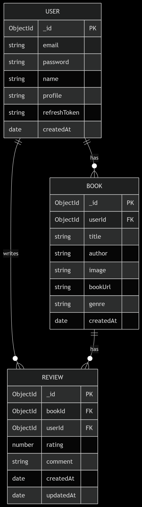

# Database Schema Design

## Collections Overview

### 1. Users
```javascript
{
  _id: ObjectId,        // Unique user identifier
  email: String,        // Required, unique, validated format
  password: String,     // Required, min 8 characters
  name: String,         // Required, min 3 characters
  profile: String,      // URL to profile image (optional)  AWS media key
  refreshToken: String, // For authentication
  createdAt: Date      // Auto-generated
}
```

### 2. Books
```javascript
{
  _id: ObjectId,        // Unique book identifier
  userId: ObjectId,     // Reference to User who uploaded
  title: String,        // Required, trimmed
  author: String,       // Required, trimmed
  image: String,       // Required, AWS media key to cover image
  bookUrl: String,     // Required, AWS media keyto book content
  genre: String,       // Required, trimmed
  createdAt: Date      // Auto-generated
}
```

### 3. Reviews
```javascript
{
  _id: ObjectId,        // Unique review identifier
  bookId: ObjectId,     // Reference to Book being reviewed
  userId: ObjectId,     // Reference to User who wrote review
  rating: Number,      // Required, 1-5 scale
  comment: String,     // Optional, trimmed
  createdAt: Date,     // Auto-generated
  updatedAt: Date      // Auto-updated
}
```

## Relationships Diagram
### PK (Primary Key) and FK (Foreign Key)
  

## Key Features

1. **Data Validation**:
   - All required fields enforce presence validation
   - Email format validation
   - Rating constrained to 1-5 range
   - Minimum length checks for passwords and names

2. **References**:
   - `userId` in Books → Users collection
   - `bookId` and `userId` in Reviews → respective collections

3. **Timestamps**:
   - Automatic `createdAt` tracking on all documents
   - Automatic `updatedAt` for review modifications

4. **Plugins**:
   - `mongoose-aggregate-paginate-v2` enabled for all collections

## Indexes

| Collection | Indexed Fields       | Type    |
|------------|----------------------|---------|
| Users      | `email`              | Unique  |
| Books      | `userId`, `genre`    | Regular |
| Reviews    | `bookId`, `userId`   | Compound|
